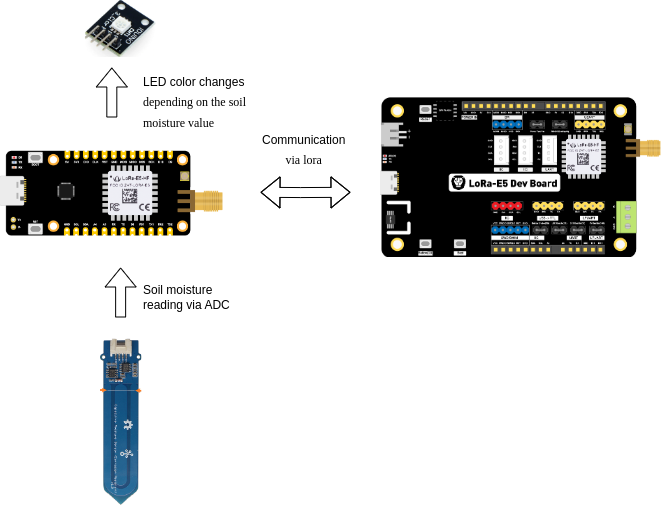
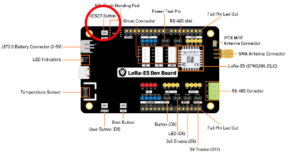
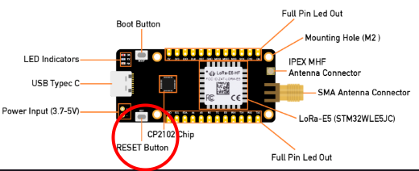
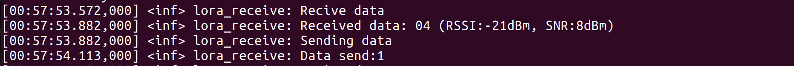
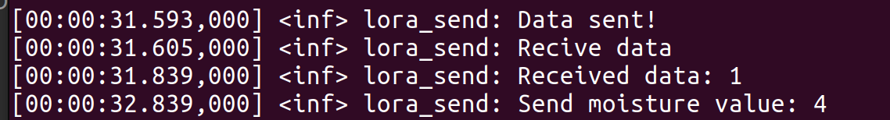
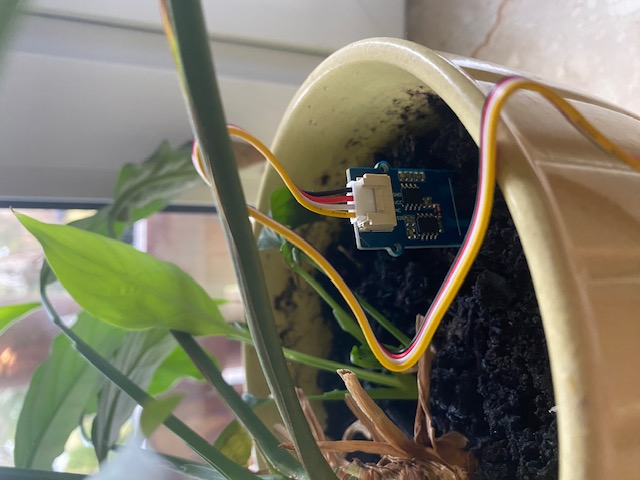
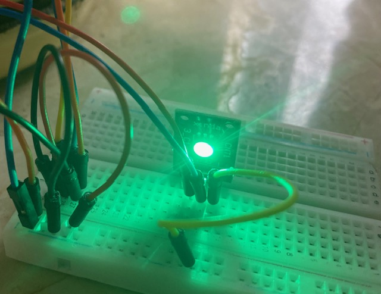
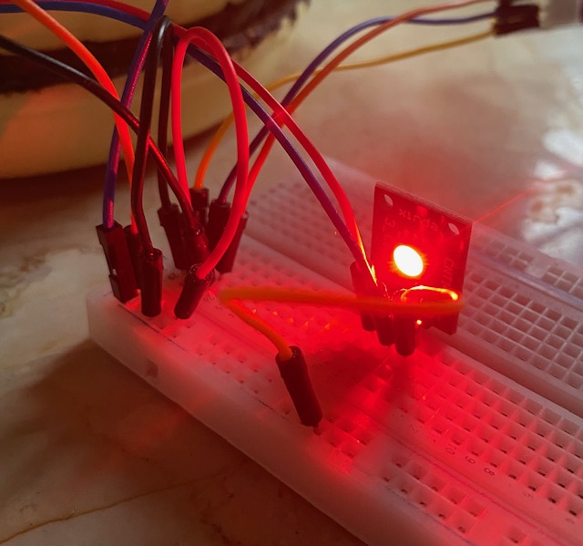

# Soil moisture system using grove capicty moisture sensor, Wio E5 dev board and Wio E5 mini board

## Introduction


The system consists of the following hardware: 
* Wio-E5 Development Kit: https://wiki.seeedstudio.com/LoRa_E5_Dev_Board/
* Wio-E5 Mini: https://wiki.seeedstudio.com/LoRa_E5_mini/
* Grove - Capacitive Moisture Sensor (Corrosion Resistant): https://wiki.seeedstudio.com/Grove-Capacitive_Moisture_Sensor-Corrosion-Resistant/
* RGB led
Soil moisture system includes:
* Reading soil mositure level via ADC on mini board.
* Sending data about mositure level via LoRa to dev board.
* Receiving this data and sending instuctions to mini board about, what color rgb led, should light up.

## Technologies
Project is created with:
* Zephyr: 3.1.0
* Zephyr SDK: 0.14.2

## Prerequisites
1. It is necessary to have Zephyr already installed to build or flash application.
   * Go to the official Zephyr RTOS website (https://docs.zephyrproject.org/latest/develop/getting_started/index.html) to download the latest version.
2. Install Build Tools:
* Zephyr RTOS uses build tools like CMake and Ninja. Use following commands to install both:
```
sudo apt-get update
sudo apt-get install cmake
sudo apt-get install ninja-build
```
3. Install picom
* To communicate with your board you have to install picom:
```
sudo apt-get -y install picom
```        

## E5 dev board setup             
To build version for the e5 dev board, you need an unlocked board, (this shows how to unlock board https://wisevision.tech/docs/LoRa/LoRa-e5-dev-board-unprotect-memory) connected via UART and st-link.
1. Copy Source code from github into zephyrpoject directory:
```
cd ~/zephyrpoject
git clone -b zephyr-3.1.0 https://github.com/wise-vision/project-cezary.git
```
2. Navigate to the build directory::
```
cd ~/zephyrpoject/project-cezary/boards/e5_dev_board
```
3. Build source code:
```
west build -b lora_e5_dev_board
```
Build is successful when all of the build jobs are finished. To test, upload the build to the board.
4. Upload your build to board:

To flash your board you hace to connect board via usb to computer for power and via st-link for flashing.
```
west flash
```
Flash is successful when all of the flasj jobs are finished.
5. After build and flash to the board, to run the app press the reset button on board.


## E5 mini board setup
To build versions for the e5 mini board, you need an unlocked board(this shows how to unlock board https://wisevision.tech/docs/LoRa/LoRa-e5-dev-board-unprotect-memory), connected via UART and st-link.
1. Copy Source code from github into zephyrpoject directory:
```
cd ~/zephyrpoject
git clone https://github.com/wise-vision/project-cezary.git
```
2. Navigate to the build directory::
```
cd ~/zephyrpoject/project-cezary/boards/e5_mini
```
3. Build source code:
```
west build -b lora_e5_dev_board
```
Build is successful when all of the build jobs are finished. To test, upload the build to the board.
4. Upload your build to board:

To flash your board you hace to connect board via usb to computer for power and via st-link for flashing.
```
west flash
```
Flash is successful when all of the flasj jobs are finished.

5. After build and flash to the board, to run the app press the reset button on board.



## Code of E5 dev board
### prj.conf
These configurations help customize the Zephyr OS for specific hardware and functionality requirements.
```c
CONFIG_LOG=y
CONFIG_SPI=y
CONFIG_GPIO=y
CONFIG_LORA=y
CONFIG_CBPRINTF_FP_SUPPORT=y

# Zephyr v3.1
CONFIG_LORA_SX12XX=y
```
### src/main.c
This function is for configuarting reception.
```c
int configureRx(const struct device *const lora_dev)
{
	struct lora_modem_config config;
	config.frequency = 865100000;
	config.bandwidth = BW_125_KHZ;
	config.datarate = SF_10;
	config.preamble_len = 8;
	config.coding_rate = CR_4_5;
	config.tx_power = 14;
	config.tx = false;

	int ret = lora_config(lora_dev, &config);
	if (ret < 0) {
		LOG_ERR("LoRa config failed");
	}
	return ret;
}
```
 LoRa newtork has few things to confing, but we have only to choose the frequnecy. Frequnecy is diffrent for diffrent regions.
Freuqency plans:
* Europe: 863-870 Mhz
* United States: 902-928 Mhz
* Austraulia: 915-928 Mhz
* China 470-510 Mhz
* Asia/Japan 920-923 Mhz
* Morocco 869-870 Mhz
* India 865-867 Mhz
* Russia 864-870 Mhz

This function is for configuarting transmission. Like in previous function we have to choose to correct frequnecy.

```c
int configureTx(const struct device *const lora_dev)
{
	struct lora_modem_config config;
	config.frequency = 865100000;
	config.bandwidth = BW_125_KHZ;
	config.datarate = SF_10;
	config.preamble_len = 8;
	config.coding_rate = CR_4_5;
	config.tx_power = 4;
	config.tx = true;

	int ret = lora_config(lora_dev, &config);
	if (ret < 0) {
		LOG_ERR("LoRa config failed");
	}
	return ret;
}
```
This function reciving data from min board and shows info about moisture in `LOG_INF`
```c
void recevMsg(const struct device *dev, uint8_t *data, int16_t rssi, int8_t snr){
	int len;
	configureRx(dev);
	LOG_INF("Recive data");
	len = lora_recv(dev, data, MAX_DATA_LEN, K_FOREVER, &rssi, &snr);
	if (len < 0) {
		LOG_ERR("LoRa receive failed");
		return 0;
	}

	LOG_INF("Received data: %s (RSSI:%ddBm, SNR:%ddBm)", data, rssi, snr);
}
```
This function send data 0 if the soil moisture is accurate and 1 if our plant needs water.
```c
void sendMsg(const struct device *dev, uint8_t *data, int16_t rssi, int8_t snr){
	char data_send[MAX_DATA_LEN] = {0};
	int ret;
	LOG_INF("Sending data");
	int converted_value = atoi(data);
	if (converted_value<30){
	data_send[0]='1';
	}else{
	data_send[0]='0';
	}
	configureTx(dev);
	ret=lora_send(dev,data_send,1);
	if (ret < 0) {
		LOG_ERR("LoRa send failed");
	}else{
		LOG_INF("Data send:%s",data_send);
	}

}
```
 The correct level of moisture is set for under 30 %. It could be change for your purpose.

 In main function we recev and send messegs form board to bord with 1 second interval.
```c
int main(void)
{
	const struct device *const lora_dev = DEVICE_DT_GET(DEFAULT_RADIO_NODE);
	uint8_t data[MAX_DATA_LEN] = {0};
	int16_t rssi;
	int8_t snr;

	if (!device_is_ready(lora_dev)) {
		LOG_ERR("%s Device not ready", lora_dev->name);
		return 0;
	}
	while(1){
		recevMsg(lora_dev, data, rssi, snr);
		sendMsg(lora_dev, data, rssi, snr);
		k_sleep(K_MSEC(1000));
	}
	k_sleep(K_FOREVER);
	return 0;
}
```

## Code of mini board
### boards/lora_e5_dev_board.overlay
This part of device tree defines Analog to Digital converter pins. 
```c

/ {
	zephyr,user {
		/* adjust channel number according to pinmux in board.dts */
		io-channels = <&adc1 2>;
	};
};

&adc1 {
	#address-cells = <1>;
	#size-cells = <0>;
	pinctrl-0 = <&adc_in2_pb3>;
	
	status = "okay";
	
		channel@2 {
		reg = <2>;
		zephyr,gain = "ADC_GAIN_1";
		zephyr,reference = "ADC_REF_INTERNAL";
		zephyr,acquisition-time = <ADC_ACQ_TIME_DEFAULT>;
		zephyr,resolution = <12>;
		};
};
```
Channel 2 is used because in E5 mini board it is deafult channel.
### prj.conf
It has the same use like in dev board, but its added more configs:
*ADC for reading values from moisture sensor.
*GPIO for changeing colour of led.
```c
CONFIG_ADC=y
CONFIG_SHELL=y
CONFIG_LOG=y
CONFIG_SPI=y
CONFIG_GPIO=y
CONFIG_LORA=y

# Zephyr v3.1
CONFIG_LORA_SX12XX=y
```
### src/main.c
`configureRx and configureTx`

This functions are the same as on dev boards. If we want communication between two boards, we have to set the same frequency.

This function is used to translet masurments from ADC to 0-100 values.
```c
const int DryValue = 1950;
const int WetValue = 1220;
int mapSoilMoisture(int value, int inMin, int inMax, int outMin, int outMax) {
    return (value - inMin) * (outMax - outMin) / (inMax - inMin) + outMin;
}
```
 If we want to have correct values of moisture, we have to make a calibration of the sensor. 

#### Calibration of the sensor
* Check the value of dry sensor and write it into DryValue
* Check the value of the sensor puted in the water and write it into WetValue.

This function sends data too dev board about soil moisture.
```c
void sendMsg(const struct device *dev, int moisture){
	int ret;
	LOG_INF("Received moisture value: %d\n", moisture);
	char data[MAX_DATA_LEN];
	char moisture_str[MAX_DATA_LEN];
	snprintf(moisture_str, sizeof(moisture_str), "%.2d", moisture);
	memset(data, 0, sizeof(data));
	strncpy(data, moisture_str, sizeof(data) - 1);
	configureTx(dev);
	ret = lora_send(dev, data, MAX_DATA_LEN);
	if (ret < 0) {
		LOG_ERR("LoRa send failed");
		return 0;
	}

	LOG_INF("Data sent!");

}
```
This function recevs data from dev board.
```c
void recevMsg(const struct device *dev, uint8_t *data_recive, int16_t rssi, int8_t snr){
	int len;
	configureRx(dev);
	LOG_INF("Recive data");
	len = lora_recv(dev, data_recive, MAX_DATA_LEN, K_FOREVER, &rssi, &snr);
	if (len < 0) {
		LOG_ERR("LoRa receive failed");
		return 0;
	}

	LOG_INF("Received data: %s", data_recive);
}
```
This function configs gpios outputs for led controling.
```c
void gpiosConfig(const struct device *gpio1, const struct device *gpio2){
	int ret;
	ret = gpio_pin_configure(gpio1, 0, GPIO_OUTPUT_ACTIVE);//green
	if (ret != 0) {
		return;
	}
		ret = gpio_pin_configure(gpio2, 10, GPIO_OUTPUT_ACTIVE);//green
	if (ret != 0) {
		return;
	}
	if(!device_is_ready(gpio1)){
		return;
	}
	if(!device_is_ready(gpio2)){
		return;
	}


}
```
This function is used to configure analog to digital converter.
```c
void adcConfig(){
	int err;
	for (size_t i = 0U; i < ARRAY_SIZE(adc_channels); i++) {
		if (!adc_is_ready_dt(&adc_channels[i])) {
			LOG_INF("ADC controller device %s not ready\n", adc_channels[i].dev->name);
			return 0;
		}

		err = adc_channel_setup_dt(&adc_channels[i]);
		if (err < 0) {
			LOG_INF("Could not setup channel #%d (%d)\n", i, err);
			return 0;
		}
	}
}
```
This function returns values of moisture in range 0-100.

```c
int adcVal(){
	uint16_t buf;
	struct adc_sequence sequence = {
		.buffer = &buf,
		.buffer_size = sizeof(buf),
	};
	int err;
	int moisture;
	for (size_t i = 0U; i < ARRAY_SIZE(adc_channels); i++) {
		int32_t val_mv;
		(void)adc_sequence_init_dt(&adc_channels[i], &sequence);
		err = adc_read_dt(&adc_channels[i], &sequence);
		if (err < 0) {
			
			continue;
		}
		if (adc_channels[i].channel_cfg.differential) {
			val_mv = (int32_t)((int16_t)buf);
		} else {
			val_mv = (int32_t)buf;
		}
		err = adc_raw_to_millivolts_dt(&adc_channels[i],&val_mv);
		int val_int = (int)val_mv;
		moisture = mapSoilMoisture(val_int, DryValue, WetValue, 0, 100);

	}
	return moisture;
}
```
This function sets color of leds depending on the values send from dev board.
```c
void setLed(uint8_t *data_recive, const struct device *gpio1, const struct device *gpio2){
	int ret;
	int SetLed = atoi(data_recive);
	if (SetLed == 1) {
		
		ret = gpio_pin_set_raw(gpio2, 10, 0);
		ret = gpio_pin_set_raw(gpio1, 0, 1);	
			
	} else {
		
		ret = gpio_pin_configure(gpio1, 5,GPIO_OUTPUT_ACTIVE); //red
		if (ret != 0) {
			return;
		}
		
		ret = gpio_pin_set_raw(gpio1, 0, 0);
		ret = gpio_pin_set_raw(gpio2, 10, 1);
			
	} 
}
```
## Zephyr 3.1.0 version changes 
### prj.conf
Additional lora configuration for this version of zephyr
```
# Zephyr v3.1
CONFIG_LORA_SX12XX=y
```
### configureRx and configureTx in src/main.c
Removed config things, which this verison of zephyr doesn't have for lora drive
```c
	config.iq_inverted = false;
	config.public_network = false;
```
### src/main.c for e5_dev_board
Changed value of `MAX_DATA_LEN` from 255 to 10, because it's caused errors in sending data 
```c
#define MAX_DATA_LEN 10
```
### src/adc_zephyr_v_3_5.h for e5_mini
New file, which has function from zephyr 3.5.0, which zephyr 3.1.0 doesn,t have for adc driver. It's coppied from zephyr 3.5.0.
## Conclusion
If you flashed your board with built programs you can check their logs.
To see logs
1. Open terminal
2. Use command `sudo picocom --baud 115200 /dev/"your_usb_port"`
### On Wio E5 dev board kit logs should looks like this:



* Receivd data informs that data has been recieved
* Recived data shows value of moisture
* Sending data informs that data has been sended
* Data send shows value that has been send: 1 indicates a need for watering the plant, and 0 indicates that the soil moisture is correct.
* Blinking led on board informs that there is connection via uart.
### On Wio E5 mini board logs should looks like this:



* Data send! infroms that data has been sended
* Receive data informs that data has been received
* Receive Data shows the value sent from the dev board: 1 indicates a need for watering the plant, and 0 indicates that the soil moisture is correct.
* Send moisture data shows value of moisture
* Blinking led on board informs that there is connection via uart.
## Use case
If evertyhing is already set, put soil moisture sensor in our plant:

On the sensor there is a white straight line, wich shows how deep it should be puted in soil.
### Correct soil moisture
If soil moisture is correct so it means that soil moisture is higher than 30% and rgb led lights green:

### Incorrect soil moisture
If soil moisture is not correct so it means that soil moisture is lower than 30% and rgb led lights red:


