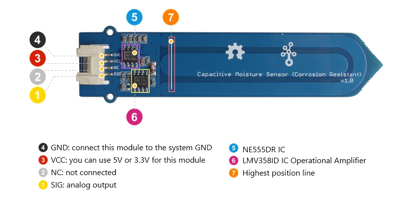
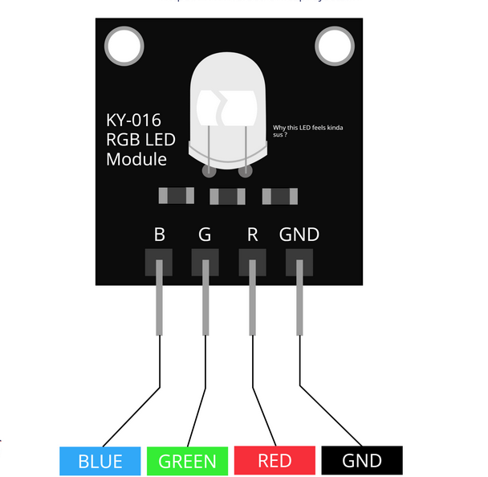

# Hardware preparation for soil moisture system on Wio E5 dev board and Wio E5 mini board
## Wio E5 dev board preparation
### Flashing
* For flashing the board you have to unlock board like here (https://wisevision.tech/docs/LoRa/LoRa-e5-dev-board-unprotect-memory)
* After this operation st-link should be still connected to your pc and board like on diagram below.
 
* Your lora antenna should be connected to board.
* Remember if you want fo flash your board you have to build your code firstly na you have to connect you board to power it. You could do it by uart connection.
## Wio E5 mini board.
### Flashing
Do every step from Wio E5 dev board and:
#### Connections
 
 
Moisture sensor connections:
* GND to system GND
* VCC to 3v3
* SIG to A3
RGB led connections:
 
* GND to system GND
* R to D0
* G to D10

