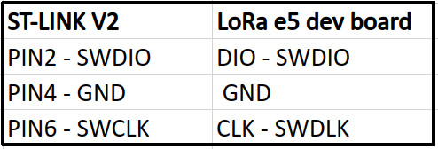

# Hardware preparation for soil moisture system on Wio E5 dev board and Wio E5 mini board
## Wio E5 dev board preparation
### Flashing
* For flashing the board you have to unlock board like here (https://wisevision.tech/docs/LoRa/LoRa-e5-dev-board-unprotect-memory)
* After this operation st-link should be still connected to your pc and board

 
